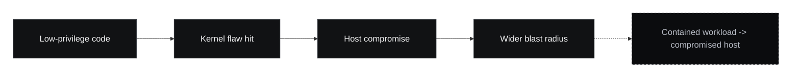
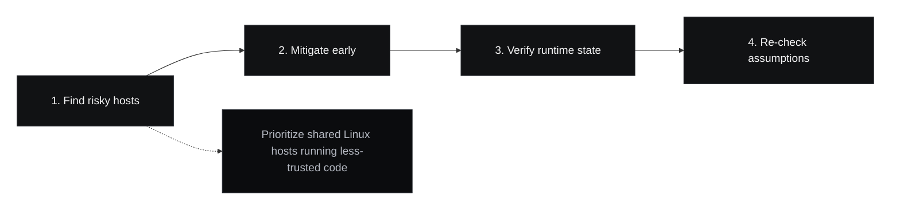

On paper, `CVE-2026-31431` looks like a familiar Linux kernel local privilege escalation. In practice, it deserves more attention than the phrase "local bug" usually gets.

The issue, now widely referred to as **Copy Fail**, was publicly disclosed on **April 29, 2026**. The [NVD entry](https://nvd.nist.gov/vuln/detail/CVE-2026-31431) attributes it to the Linux kernel's `algif_aead` handling and shows the CNA-assigned CVSS 3.1 score of `7.8` (`High`). By **April 30, 2026**, Ubuntu had already published a mitigation path through `kmod` updates while kernel fixes were still rolling out across supported releases. On **May 1, 2026**, Microsoft said the flaw had been added to the [CISA Known Exploited Vulnerabilities catalog](https://www.cisa.gov/known-exploited-vulnerabilities-catalog), which is the clearest signal that defenders should treat it as an active prioritization problem rather than a routine advisory.

That sequence matters. It tells us this is not only a kernel bug with a patch. It is a vulnerability with a short decision window.

<figure>
  
  <figcaption>
    Shared Linux infrastructure is exactly where a “local” escalation starts to stop looking local.
  </figcaption>
</figure>

## What actually makes this bug dangerous

The technical summary from [Microsoft's write-up](https://www.microsoft.com/en-us/security/blog/2026/05/01/cve-2026-31431-copy-fail-vulnerability-enables-linux-root-privilege-escalation/) and Ubuntu's [CVE page](https://ubuntu.com/security/CVE-2026-31431?pubDate=20260501) points in the same direction: an attacker with low-privilege local code execution can abuse the kernel's AF_ALG crypto path to corrupt the page cache of readable files, including privileged binaries, and turn that into root execution.

That is already bad on a single machine. What changes the risk profile is reliability and placement:

- exploitation does not require user interaction
- the privileges required are low rather than administrative
- the affected component exists in environments that often run untrusted or semi-trusted workloads
- some mitigations arrived before full kernel rollouts, which means operators had to make a tradeoff under time pressure

The usual mistake is to translate all of that into: "someone already has shell access, so this is not urgent." That reading is too narrow for modern systems.

## Why “local” does not stay local in modern fleets

In older threat models, a local privilege escalation mostly changed the severity of an already-compromised workstation. In current cloud and platform environments, local code execution is often an expected condition somewhere in the stack:

- CI jobs run code from branches, pull requests, and build pipelines
- shared compute nodes execute workloads from multiple teams
- container platforms run applications that parse attacker-controlled input all day
- internal tooling regularly grants limited shell or task execution capabilities to developers, automation, or third-party integrations

Once you accept that low-privilege code execution is not rare, a bug like Copy Fail stops being a host-level edge case. It becomes a control-boundary problem.

This is the key operational point: **the more your platform depends on "unprivileged" execution as a safety boundary, the more a local kernel escalation behaves like an infrastructure vulnerability.**

The important boundary is not "local vs remote." It is "contained workload vs compromised host."

## Where the real risk shows up

For many teams, the biggest risk is not a laptop. It is the place where code from different trust levels converges.

### Container hosts

Ubuntu's [advisory](https://ubuntu.com/blog/copy-fail-vulnerability-fixes-available) explicitly notes container escape risk in deployments that may execute potentially malicious workloads. Even without a public container escape proof of concept, that warning should change how operators prioritize patching on shared worker nodes, CI runners, and Kubernetes hosts.

If a platform assumes containers give enough separation for untrusted builds or customer-defined workloads, a local-to-root kernel path changes the threat model immediately.

### CI and build infrastructure

Build systems are full of temporary trust. A job may start with access to a repo checkout, build cache, package mirror, artifact token, or deployment credential, but not root. A kernel LPE turns that temporary constrained environment into a much wider compromise surface.

That does not just threaten one runner. It can threaten:

- other jobs on the same host
- cached credentials and artifact material
- downstream deployment systems
- secrets mounted for build or release automation

### Multi-tenant internal platforms

Some organizations run "internal PaaS" environments where teams can ship code without direct root access. Those platforms often rely on careful privilege reduction, namespaces, and policy controls. A bug like Copy Fail attacks the assumption that this lower privilege level is enough to contain a workload.

That is why the label matters less than the boundary it crosses. "Local" is the access method. It is not the impact boundary.

## What operators should do now

The right response is operationally boring and fast.

The first useful triage step is to rank systems by workload trust and sharing, not just by package version.

### 1. Separate exposure by workload trust, not just by distro

Do not ask only, "Are we running a vulnerable kernel?" Also ask:

- Which hosts run code we do not fully trust?
- Which systems allow shell, job, or build execution by many users or tenants?
- Which nodes back CI, Kubernetes, serverless workers, or internal automation?

Those are the places where Copy Fail should move to the front of the patch queue.

### 2. Apply mitigation even if the full kernel rollout is not ready

Ubuntu's response is useful because it documents a real tradeoff. The team released `kmod` updates that disable loading `algif_aead` until kernel fixes are available, but also notes possible regression risk for workloads that depend on hardware-accelerated cryptography or do not gracefully fall back to userspace implementations.

That is operationally valuable guidance because it is honest. The right question is not "Is the mitigation perfect?" It is "Which is worse today: the regression risk or the window for root compromise on shared Linux infrastructure?"

On high-risk hosts, the answer is usually straightforward.

### 3. Treat host restarts and module state as part of remediation

Ubuntu also notes that already running applications may be affected when the module is disabled or unloaded, and that a reboot may be required to trigger fallback behavior. In other words, package state alone is not the whole story.

If your runbook stops at package installation and never checks active module state, running kernel version, or reboot status, you do not yet have a finished response.

### 4. Re-check assumptions around “low privilege”

This is the longer-term lesson. Teams often spend a lot of time tightening IAM, RBAC, and namespace policies while still assuming that "non-root on the box" is a strong enough security boundary. Kernel bugs keep punishing that assumption.

Low privilege is still worth having. It just cannot be the last line of reasoning in environments that execute risky code continuously.

## What this case says about Linux operations

Copy Fail is a reminder that vulnerability severity should be read in context, not only in scoring tables.

A CVSS `7.8` local privilege escalation on a single-purpose host with no untrusted execution path may be urgent but manageable. The same bug on CI runners, build nodes, research clusters, shared bastions, or container hosts is a different operational category. It is closer to platform compromise than to workstation hygiene.

That is why the best reading of this CVE is not "local root bug, patch when convenient." The better reading is:

> if your infrastructure regularly executes code with limited privileges, then local kernel escalation is part of your platform risk, not an afterthought

This is not a new lesson, but it is one teams keep relearning under pressure.

## Sources

- [NVD: CVE-2026-31431](https://nvd.nist.gov/vuln/detail/CVE-2026-31431)
- [Microsoft Security Blog: CVE-2026-31431 and cloud impact](https://www.microsoft.com/en-us/security/blog/2026/05/01/cve-2026-31431-copy-fail-vulnerability-enables-linux-root-privilege-escalation/)
- [Ubuntu CVE page: status, severity, and patch references](https://ubuntu.com/security/CVE-2026-31431?pubDate=20260501)
- [Ubuntu advisory: mitigation and operational notes](https://ubuntu.com/blog/copy-fail-vulnerability-fixes-available)
