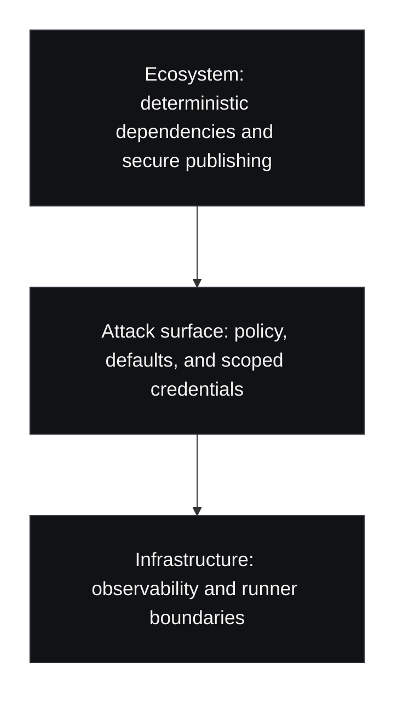

For a long time, CI security was often framed as a secret-handling problem.

Do not leak credentials. Do not echo tokens in logs. Lock down repository secrets. Keep environment variables tidy. All of that still matters, but it is no longer enough to describe the real shape of CI/CD risk.

GitHub's `2026` Actions security roadmap makes that clear. The framing is broader and more structural: secure publishing, deterministic dependencies, scoped credentials, secure defaults, runner observability, and enforceable network boundaries. The roadmap explicitly groups the problem into three layers: **ecosystem**, **attack surface**, and **infrastructure**.

That is the important shift. Actions security is moving from `where do we store the secret?` toward `what behavior does the platform allow by default, and what can we observe or prevent when it matters?`

## What changed

In GitHub's roadmap post, the problem statement is not subtle.

The post says current CI/CD risk includes:

- vulnerabilities that allow untrusted code execution
- malicious workflows that run without enough observability or control
- compromised dependencies spreading across repositories
- over-permissioned credentials being exfiltrated through unrestricted network access

It then says the roadmap is not a rearchitecture of Actions, but a shift toward making secure behavior the default.

That phrasing matters. It means GitHub is acknowledging that strong CI posture cannot depend only on every team becoming unusually disciplined by hand.

## Why secret-centric security is too narrow

Secrets are only one component in a workflow system that already executes code, reaches networks, exchanges artifacts, and coordinates identity across repositories and environments.

A workflow can be dangerous even when no classic secret is mishandled:

- a dependency can be replaced upstream
- a workflow trigger can run in a context that was assumed to be safer than it is
- a token can be over-scoped without being visibly leaked
- a runner can make network connections that nobody expected or monitored

Once you look at the problem this way, secret storage starts to look like necessary hygiene rather than the center of the model.

The center of the model is **control**.

## The three-layer model is the useful part

The strongest part of the roadmap is not any single promised feature. It is the layered framing.

That layering is useful because it reflects how CI failures actually happen.

### Ecosystem

At this layer, the question is whether the inputs to a build are stable and attributable enough. Secure publishing, provenance, and dependency integrity belong here.

### Attack surface

At this layer, the question is what workflows are allowed to do by default. Which events can trigger them? What permissions are attached? What policy checks exist before dangerous behavior happens?

### Infrastructure

At this layer, the question is what a runner can reach, what it can exfiltrate, and what operators can actually see in real time.

This is a much better model than treating CI as a sealed box with a secrets vault attached to the side.

## What teams should do now

The roadmap is aspirational in parts, but the operational lesson is immediate. Teams should evaluate their current Actions posture the same way the roadmap frames the system.

### 1. Reduce default trust, not only leaked trust

Most workflow reviews still ask whether secrets are exposed. Fewer ask whether the workflow starts from a position of excessive permission.

That means checking:

- default `GITHUB_TOKEN` permissions
- which events can invoke release-sensitive workflows
- whether forked or semi-trusted code paths reach dangerous jobs
- whether publish, deploy, and build duties are over-combined

The main question is not only *can a secret leak?* It is *what is the workflow trusted to do before anything visibly goes wrong?*

### 2. Treat CI policy as part of platform engineering

If workflow security is mostly expressed through individual YAML conventions, it will drift.

What GitHub's roadmap gets right is the idea that secure behavior should be driven downward into defaults, policy, and platform constraints. Teams should mirror that thinking internally:

- standardize reusable workflows
- standardize permission baselines
- standardize release paths
- standardize exceptions instead of handcrafting every pipeline

That is not bureaucracy. It is how CI becomes governable at scale.

### 3. Expand observability expectations

The roadmap's emphasis on runner observability is important because a surprising amount of CI execution still behaves like a temporary black box.

If a job reaches a strange host, downloads an unusual artifact, or uses a credential in an unexpected sequence, many teams only notice after the fact. Better observability does not prevent everything, but it changes the quality of response. It turns guesswork into timeline reconstruction.

### 4. Revisit the boundary between build and release

A lot of CI pipelines still collapse building, testing, packaging, signing, and publishing into one trust envelope. That makes every earlier compromise more valuable.

The roadmap's combination of secure publishing and scoped credentials should be read as a prompt to narrow release boundaries wherever possible.

## The broader lesson

There is a pattern here that extends beyond GitHub Actions.

When a platform matures, its security story usually moves through stages:

1. `Use it carefully`
2. `Use it carefully, with these best practices`
3. `Use it within stronger defaults and policy boundaries`

GitHub Actions is increasingly in the third stage.

That is good news, but it also removes an excuse. Teams can no longer pretend CI/CD security is only about careful secret handling and a few review checklists. It is becoming what it should have always been: a platform control problem with identity, policy, and infrastructure consequences.

The real work now is not memorizing a longer list of warnings. It is adopting a mental model that matches the system we are actually running.

## Sources

- [GitHub Blog: What's coming to our GitHub Actions 2026 security roadmap](https://github.blog/news-insights/product-news/whats-coming-to-our-github-actions-2026-security-roadmap/)

