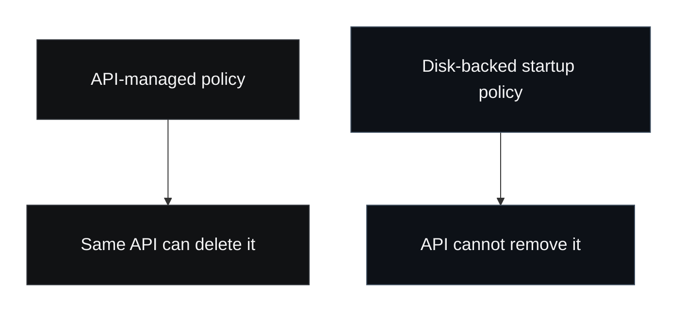

Kubernetes has a long history of giving operators expressive policy tools while leaving one uncomfortable question partially unresolved: what protects the policies themselves?

`Kubernetes v1.36` introduces an alpha feature called **manifest-based admission control**, and the most interesting thing about it is not syntax. It is the premise.

The Kubernetes project now explicitly describes a path where admission webhooks and `CEL`-based policies can be defined as files on disk, loaded by the API server at startup, before it serves any requests. The companion blog post goes one step further and shows why that matters: platform teams can use this model to prevent deletion or modification of critical API-based admission policies, and the protection itself lives on disk where it cannot be removed through the API.

That is a bigger idea than it first appears to be.

## What changed

The `v1.36` release post describes manifest-based admission control as a more declarative and consistent configuration model for admission controllers. The dedicated feature post then sharpens the security angle:

- admission configuration can be loaded from files on disk at API server startup
- that startup-time configuration can protect API-based admission policies
- the protection cannot be modified or deleted through the Kubernetes API

For operators used to thinking about admission only in terms of webhook logic or policy expression, this is an important reframing. The innovation is not only *what* the policy says. It is *where* the policy lives, and therefore how hard it is to remove under pressure.

## Why API-resident policy is not always a strong enough boundary

There is a common security reflex in Kubernetes:

1. define an admission policy
2. apply it to the cluster
3. assume the cluster is now protected by that rule

That works only as long as the rule itself remains durable enough to matter.

If the enforcement object lives exclusively in the same API surface that a sufficiently privileged actor can edit or remove, then the protection is softer than it looks. It still has value, but it is not the strongest possible boundary.

This matters most in shared clusters where multiple roles, platforms, controllers, and administrators interact. In those environments, `who can delete the guardrail?` is just as important as `what does the guardrail validate?`

## The useful mental model is survivability

Platform security teams often talk about policy in terms of expressiveness:

- can it validate the right fields?
- can it mutate objects safely?
- can it express exceptions?

Those questions matter, but they are incomplete. The more serious question is survivability:

- does the protection survive ordinary API-level change?
- does it survive operator error?
- does it survive a privileged but compromised actor?
- does it survive the thing it is meant to constrain?

Manifest-based admission control is compelling because it improves survivability, not merely usability.

That is the core boundary difference. One policy lives inside the room it is trying to secure. The other is anchored outside that room.

## Why this matters for real platform teams

Most cluster operators do not need every policy to become startup-time configuration. But some policies are clearly more foundational than others.

Examples include policies that:

- protect admission resources themselves
- prevent risky mutating or validating configuration changes
- preserve baseline workload restrictions
- enforce invariants that should not disappear during a bad day

The Kubernetes blog post demonstrates exactly this kind of use case by protecting labeled admission resources from modification or deletion.

That is not just clever. It acknowledges the operational reality that policy-management objects are themselves high-value targets.

## What teams should do now

### 1. Identify which policies are foundational

Not every rule belongs at startup time. Start by classifying admission controls into:

- foundational controls that should be hard to remove
- ordinary workload policies that can remain API-managed
- experimental or fast-changing policies that benefit from agility

The first category is where this feature becomes strategically useful.

### 2. Evaluate policy durability, not only policy coverage

A cluster can have many policies and still have weak security posture if the wrong actor can erase the important ones quickly.

Policy inventory reviews should start asking:

- which controls defend the control plane itself?
- which controls would materially change our posture if removed?
- how quickly would we detect their removal?
- should any of them live outside ordinary API mutation paths?

### 3. Use this feature to reduce fragile trust assumptions

A lot of cluster hardening quietly assumes that admin-level change will remain benign or fully observable. That is not always realistic in large organizations or during incidents.

Moving some protections into startup-time disk-backed configuration reduces the amount of trust you must place in day-to-day API mutability.

### 4. Keep the feature in proportion

This is an `alpha` feature. It is not a reason to rebuild every admission pattern or oversell the maturity of the approach. But it is worth paying attention to because the design direction is sound: some boundaries should be harder to erase than the resources they defend.

## The broader lesson

Kubernetes security often gets discussed in terms of policy language, RBAC shape, or workload restrictions. Those matter. But there is a more basic lesson underneath this feature:

**the durability of a protection is part of the protection.**

A beautifully expressive rule that disappears at the wrong moment is weaker than a narrower rule that stays in place when it counts.

Manifest-based admission control matters because it brings that truth into the product surface more directly. It gives operators a way to think not only about *what should be enforced*, but also about *what should be harder to undo*.

That is a worthwhile direction for Kubernetes platform security.

## Sources

- [Kubernetes Blog: Admission Policies That Can't Be Deleted](https://kubernetes.io/blog/2026/05/04/kubernetes-v1-36-manifest-based-admission-control/)
- [Kubernetes Blog: Kubernetes v1.36 release](https://kubernetes.io/blog/2026/04/22/kubernetes-v1-36-release/)

