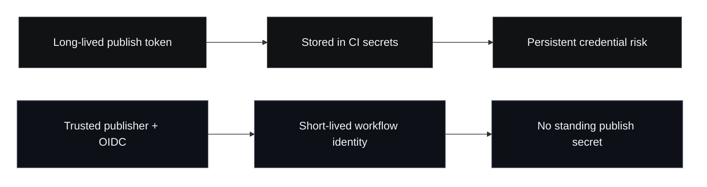

The default mental model around npm publishing is now out of date.

Many teams still treat a registry publish token as ordinary CI plumbing: create one, store it as a secret, wire it into a release workflow, and move on. That used to be common practice. It should not be treated as the steady-state target any longer.

The current npm documentation points in a different direction. The official guidance now recommends **trusted publishing** for package publishing from CI/CD workflows and describes it as an `OIDC`-based path that removes the need for long-lived npm tokens. The same documentation also says trusted publishers use short-lived, scoped credentials that are generated on demand during the workflow itself. That is a meaningful shift in security posture, not a minor implementation detail.

The practical conclusion is simple: if your team still relies on long-lived publish tokens for npm releases, that setup should be treated as **migration debt**.

## What changed

Two pieces of npm documentation matter here.

First, the trusted publishing documentation says npm packages can be published directly from CI/CD workflows using `OpenID Connect (OIDC)` authentication. It also includes an explicit `Why this matters` section: trusted publishers use short-lived, scoped credentials generated during the workflow, which removes the need to keep traditional long-lived tokens around.

Second, npm's CI/CD workflow guidance now says package publishing should use trusted publishing when available, not access tokens. That page also carries a stronger signal than many teams have internalized: **legacy access tokens were removed as of November 2025**. When tokens are still needed for CI tasks, the guidance is to use granular access tokens with the minimum permissions necessary.

This is not just documentation housekeeping. It is npm drawing a boundary between older credential habits and the path it wants the ecosystem to follow.

## Why publish tokens deserve more attention than they usually get

Publish credentials are different from most CI secrets because they are not only about your pipeline. They sit on the supply chain boundary between your repository and everyone who installs what you release.

If a publish token is stolen or misused, the blast radius can include:

- malicious package versions
- poisoned dependency trees downstream
- counterfeit hotfixes that look operationally normal
- package setting changes that make later response harder

That is why long-lived publish tokens age badly. Even when they are stored in a competent secret manager, they still create a standing credential that exists outside the narrow moment of release. That is precisely the kind of credential modern supply-chain work has been trying to eliminate.

The problem is not only compromise. It is also ambiguity. A long-lived token makes it harder to answer a clean question: *what exactly was allowed to publish, and only for how long?*

## The security model npm is trying to move teams toward

npm's current guidance points to a much narrower model:

- your workflow proves identity through the CI provider
- npm trusts that identity through OIDC
- scoped credentials are generated at publish time
- the workflow publishes without a standing registry secret

That is not perfect, but it is substantially better than placing a persistent publish credential in every release pipeline and then hoping surrounding controls make it safe enough.

The key improvement is not cosmetic. It is the removal of a durable secret from the publishing path.

## What teams should do now

The right response is not to panic and rotate every credential by hand forever. It is to make the publishing path more narrow and more explicit.

### 1. Separate install credentials from publish credentials

Many teams talk about `the npm token` as if all CI uses are interchangeable. They are not.

Installing private dependencies and publishing packages are different trust problems. npm's documentation still allows token-based CI access where needed, especially for package installation. But the publishing path now has a better default when the provider supports it.

That means your first cleanup step is classification:

- workflows that only install packages
- workflows that publish packages
- workflows that do both and should probably be split

The publishing workflows should be first in line for migration.

### 2. Move supported publish paths to trusted publishing

npm documents trusted publishing support for:

- `GitHub Actions` on GitHub-hosted runners
- `GitLab CI/CD` on GitLab.com shared runners

If your release workflow already lives there, the existence of a long-lived publish token is not just a legacy detail. It is usually evidence that the workflow has not been modernized yet.

### 3. Make token use smaller where it still remains

Some teams will still need tokens in parts of CI. The current npm guidance is straightforward here too:

- use granular access tokens
- use read-only tokens for install-only CI when possible
- keep write scope narrow
- keep expiration dates short
- avoid bypass-2FA behavior unless there is no better publishing path

In other words, treat remaining tokens as constrained exceptions, not as the default foundation.

### 4. Disable token-based publishing once the new path is proven

The trusted publishers documentation includes a `Restrict token access when using trusted publishers` section for a reason. Migration is incomplete if the old publish path remains casually available forever.

The point of moving to a better boundary is to actually retire the worse one.

## The broader lesson

Software supply-chain security is full of migrations that masquerade as optional improvements for years after they stop being optional in practice.

Long-lived npm publish tokens are becoming one of those cases.

A workflow can still function while carrying security debt. That is normal. The mistake is to confuse continued functionality with an acceptable default. If the registry, the tooling, and the CI ecosystem are all converging on identity-based publishing, then secret-based publishing should now be read as a transition state.

That matters beyond npm. A lot of engineering security work is really about learning to notice when a piece of infrastructure has quietly changed categories:

- from normal to legacy
- from convenience to liability
- from habit to migration debt

npm publish tokens are in that category now.

## Sources

- [npm Docs: Trusted publishing for npm packages](https://docs.npmjs.com/trusted-publishers/)
- [npm Docs: Using private packages in a CI/CD workflow](https://docs.npmjs.com/using-private-packages-in-a-ci-cd-workflow/)

